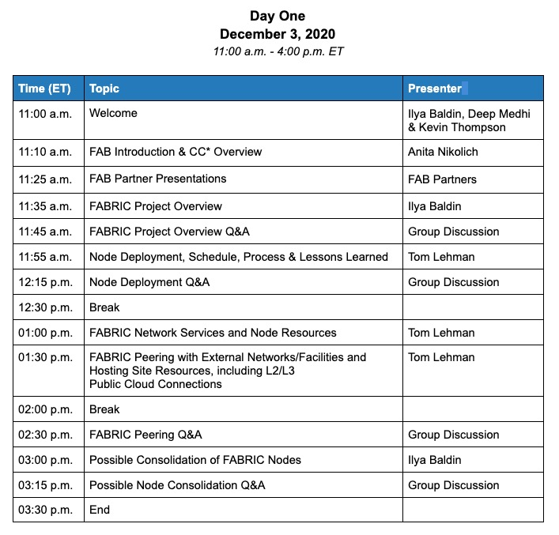

Over the course of two days, December 3-4, 2020, FABRIC will host its second virtual community workshop.

The goal of this workshop is to discuss production details with our partners. We’ll delve into specifics on connectivity and federation, discuss challenges and solutions to early deployment problems, and address initial infrastructure operations. This meeting is targeted to facilities who plan to peer with FABRIC moving forward.

\* <b>Please read <a href="https://docs.google.com/document/d/1O-tKCqAfRAf6uNuq3pmtlHG-zdESz4SSEopXE5OiktM/edit" target="\_blank">FABRIC Workshops Code of Conduct</a> before workshop.</b>

#### Agenda

Please stay informed by <a href="https://share.hsforms.com/1BWk9L7CNTe-Pp9MdVMdKWQ3ry9k" target="_blank">signing up for our newsletter</a>.
